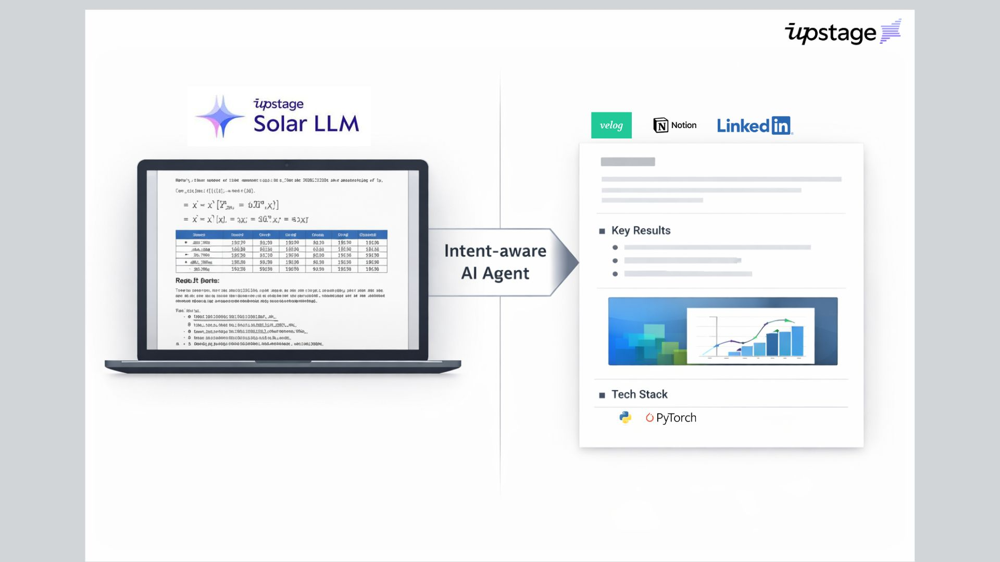

# Portfolio Migration Agent

**PDF 보고서를 포트폴리오용 마크다운으로 바꾸고, Notion에 한 번에 저장하는 에이전트**

<p align="center"></p>

과제/실험 보고서 PDF를 업로드하면, 채용·포트폴리오용 구조(Title, One-line Summary, What I Built, Key Results, Representative Visuals, Tech Stack 등)로 재작성하고, 웹 미리보기와 Notion DB 저장까지 한 번에 처리합니다.

---

## 데모

- **[데모영상 보기](https://github.com/choihyun-1110/rewrite-my-report/raw/main/%EB%8D%B0%EB%AA%A8%EC%98%81%EC%83%81.mp4)** — PDF 업로드 → 변환 → 미리보기 → Notion 저장 흐름 (클릭 시 브라우저에서 바로 재생)

---

## 주요 기능

- **PDF 파싱**: Upstage Document Parse로 텍스트 + 이미지 추출 (순서 유지)
- **포트폴리오 재작성**: Solar LLM으로 고정 8단 구조 문서 생성 (과제 톤 → 채용/포트폴리오 톤)
- **이미지**: 문서별 `assets/{doc_id}/` 격리, GitHub 업로드 후 Notion 이미지 블록 연결
- **웹 UI**: Streamlit — 업로드, 미리보기(base64 이미지), Notion 저장
- **Notion**: DB에 새 페이지 생성 또는 기존 페이지 purge 후 append, 이미지 최대 3장

---

## 기술 스택

| 구분 | 기술 |
|------|------|
| 언어 | Python 3 |
| UI | Streamlit |
| PDF/OCR | Upstage Document Parse API |
| LLM | Upstage Solar API |
| 저장소 | Notion API, GitHub(이미지) |

---

## 설치 및 실행

### 1. 저장소 클론 및 의존성 설치

```bash
git clone https://github.com/choihyun-1110/rewrite-my-report.git
cd rewrite-my-report
pip install -r requirements.txt
```

### 2. 환경 변수 설정

`.env` 파일을 만들고 아래 내용을 채우세요.

```bash
# 필수
UPSTAGE_API_KEY=your_upstage_api_key

# Notion 저장 시
NOTION_TOKEN=your_notion_integration_token
NOTION_PORTFOLIO_DB_ID=your_database_id

# Notion 이미지 표시 시 (공개 저장소 권장)
GITHUB_TOKEN=your_github_personal_access_token
GITHUB_IMAGE_REPO=your-username/your-image-repo
GITHUB_IMAGE_BRANCH=main
```

`.env.example`을 복사해 사용해도 됩니다.

```bash
cp .env.example .env
# .env 에서 키 값만 수정
```

### 3. 웹 UI 실행

```bash
streamlit run app.py
```

브라우저에서 PDF 업로드 → 변환 → 미리보기 → Notion 저장까지 진행할 수 있습니다.

### 4. CLI로만 실행 (선택)

```bash
python pipeline.py input/your_report.pdf
# 결과: output/{doc_id}/post.md, output/assets/{doc_id}/*.png 등
```

---

## 프로젝트 구조

```
.
├── app.py                 # Streamlit 웹 UI
├── pipeline.py            # PDF → parsed → post_md → tags 파이프라인
├── notion_saver.py        # Notion 저장 (이미지 업로드 + 블록 생성)
├── notion_api_client.py  # Notion API, markdown_to_blocks
├── solar_prompts.py       # 포트폴리오/README/LinkedIn 프롬프트
├── upstage_client.py      # Document Parse, Solar API
├── image_processor.py     # 이미지 저장, placeholder 치환
├── storage_client.py      # GitHub 이미지 업로드
├── tag_extractor.py       # Suggested Tags 추출
├── config.py              # 환경 변수
├── requirements.txt
├── 데모영상.mp4           # 데모 영상
└── docs/                  # 설계/검증 문서
    └── IMPLEMENTATION_SPEC.md  # 구현 명세
```

---

## 문서

- [QUICKSTART.md](QUICKSTART.md) — 빠른 시작
- [NOTION_SETUP.md](NOTION_SETUP.md) — Notion 연동
- [STORAGE_SETUP.md](STORAGE_SETUP.md) — 이미지 스토리지(GitHub)
- [docs/IMPLEMENTATION_SPEC.md](docs/IMPLEMENTATION_SPEC.md) — 구현 명세 (과제/블로그용)

---

## GitHub에 새 레포로 올리기

1. **GitHub에서 새 저장소 생성**  
   [New repository](https://github.com/new) → 이름 예: `rewrite-my-report` → Create repository (README 추가 안 해도 됨).

2. **로컬에서 git 초기화 및 푸시** (이미 git이 있으면 2번째 줄부터만):

   ```bash
   cd /path/to/auto_generate_blog
   git init
   git add .
   git commit -m "Initial commit: Portfolio Migration Agent"
   git branch -M main
   git remote add origin https://github.com/choihyun-1110/rewrite-my-report.git
   git push -u origin main
   ```

   레포 이름을 다르게 만들었다면 `rewrite-my-report` 부분만 본인 레포 이름으로 바꾸면 됩니다.

3. **데모 영상**  
   `데모영상.mp4`를 커밋에 포함해 두었으면, README의 [데모영상.mp4](데모영상.mp4) 링크로 재생/다운로드 가능합니다. (용량이 크면 [Releases](https://docs.github.com/en/repositories/releasing-projects-on-github)에 올리고 링크만 바꿔도 됩니다.)

---

## 라이선스

이 프로젝트는 수업/과제 목적으로 작성되었습니다.
